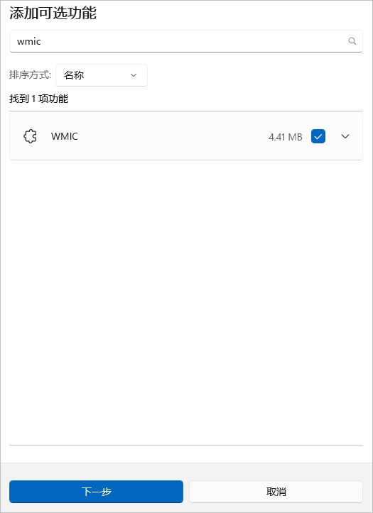

**问题现象**

点击New Emulator按钮无响应。

**解决措施**

1. 打开本地计算机的设置，查找“**可选功能**”，然后选择“**添加可选功能**”。
2. 搜索wmic，然后点击安装。

   
3. 配置系统环境变量，以Win10为例，点击**此电脑 > 属性 > 高级系统设置 > 高级 > 环境变量**，在系统Path变量中添加%SystemRoot%\\System32\\Wbem。
