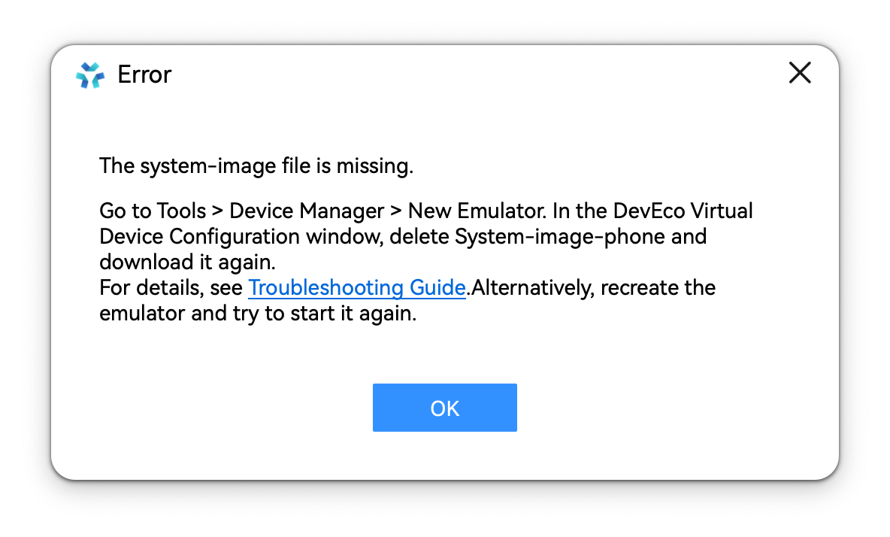

**问题现象**

启动模拟器失败，提示“system-image文件缺失”或“The system-image file is missing.”，原因是模拟器镜像文件缺失。

**解决措施**

请通过以下两种方式解决：

* 单击菜单栏的Tools > Device Manager。在Local Emulator页签，单击右下角的New Emulator按钮。在虚拟设备配置界面，更新模拟器的镜像。
* 删除已创建的模拟器，然后重新创建。
