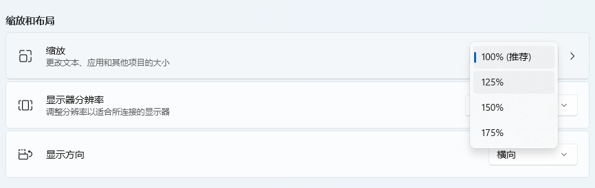
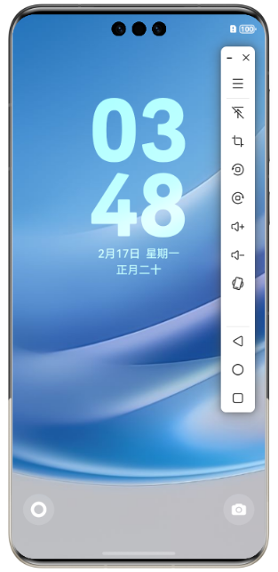
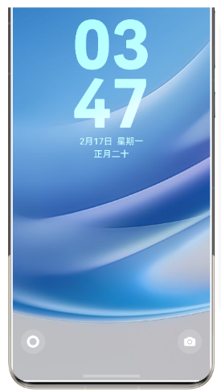

**问题现象**

打开模拟器，调整Windows设置中的屏幕缩放比例，模拟器屏幕可能出现黑边，工具栏布局混乱，边框被截断。

 

**解决措施**

手动缩放模拟器即可恢复。缩放方式参见[移动和缩放模拟器](https://developer.huawei.com/consumer/cn/doc/harmonyos-guides/ide-emulator-move-and-zoom)。
