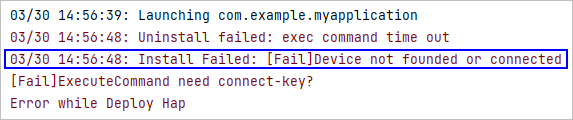

**问题现象**

场景一：调试运行时，如果安装HAP失败，提示“Device not found or connected”，请检查设备是否已正确连接。



场景二：DevEco Studio无法识别已连接的设备，显示“No device”。

**原因**

hdc工具的进程或模拟器存在问题。

**解决措施**

1. 执行以下命令，终止hdc进程，然后重新连接。

   ```
   hdc kill
   ```
2. 若按照步骤1操作后仍无法连接，请重启模拟器，然后重新尝试连接。
