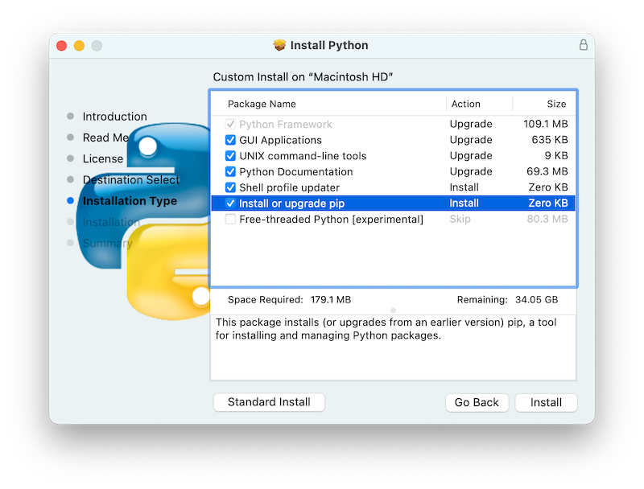
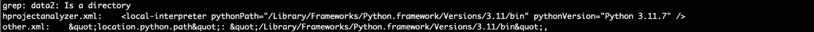

1. 下载官方Python Mac系统安装包，推荐使用 [3.11.7](https://mirrors.huaweicloud.com/python/3.11.7/python-3.11.7-macos11.pkg)。

2. Mac版本自定义安装可以不修改环境变量，请查看文档：[在 macOS 上使用 Python](https://docs.python.org/zh-cn/3/using/mac.html)不勾选UNIX command-line tools和shell profile updater。



3. 关闭DevEco Studio修改other.xml配置 。

```
cd ~/Library/Application\ Support/Huawei/DevEcoStudio6.0/options
```

```
vi other.xml
```

输入： /python，定位到location.python.path这一行, 修改后面的python路径为/Library/Frameworks/Python.framework/Versions/3.11/bin


