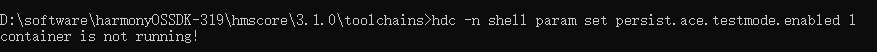
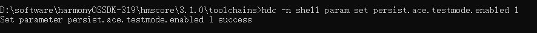

**问题现象**

在HarmonyOS设备上运行命令“hdc -n shell param set persist.ace.testmode.enabled 1”时，出现错误提示“container is not running”。

**解决措施**

在DevEco Studio中运行一个测试用例，推包到设备上，然后运行命令hdc -n shell param set persist.ace.testmode.enabled 1。

