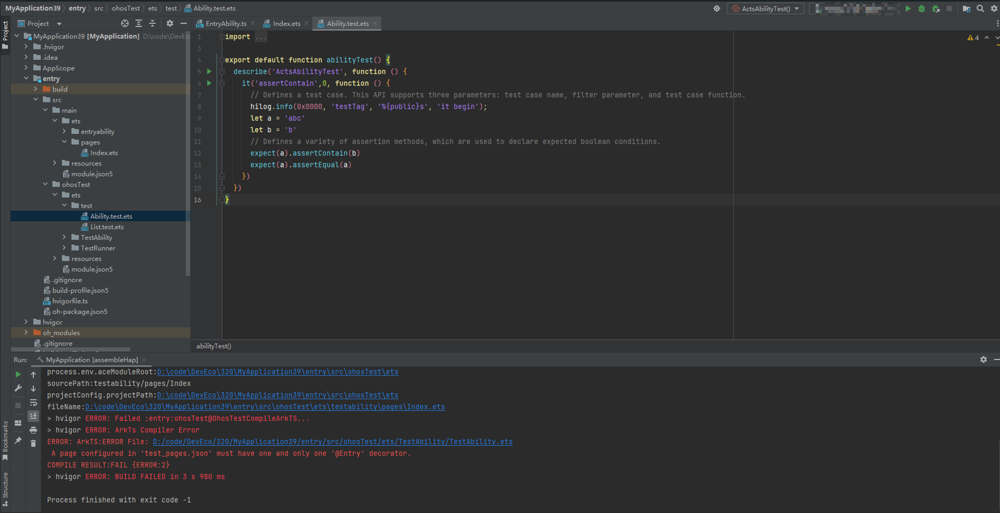
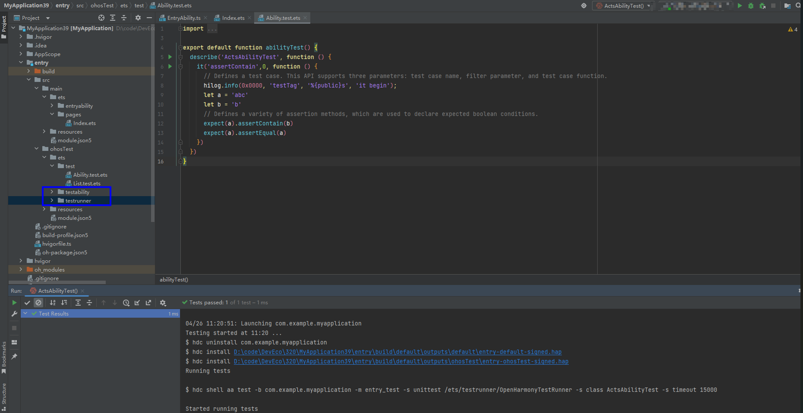

**问题现象**

如果工程是在DevEco Studio 3.1.0.400之前版本创建的，升级DevEco Studio至3.1.0.400及以上版本后，原有工程运行测试用例会失败，并提示“A page configured in 'test\_pages.json' must have one and only one '@Entry' decorator”。

**图1**

**解决措施**

将TestRunner、TestAbility目录改为小写testrunner、testability，再次运行测试用例。

**图2**

