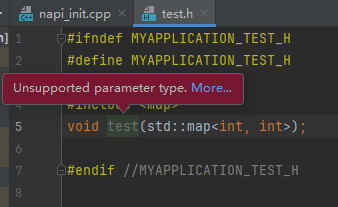
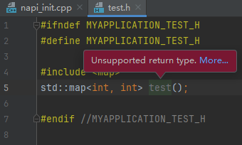

**问题现象**

右键单击函数， 在弹出的菜单中依次选择 Generate... > NAPI， 生成胶水代码报错。

**解决措施**

修改NAPI函数的参数或返回值类型。

当前支持的类型（JS 和 C++ 的类型映射关系）：

* void：void
* number: int, int32\_t, uint32\_t, int64\_t, uint64\_t, double（float不支持，NAPI接口不支持）
* string: char\*, char16\_t\*, const char\*, const char16\_t\*, char, char const, const char, std::string
* boolean：布尔值
* 用户自定义结构体类型: C++用户自定义结构体类型 class（不包括系统库的类）
* Array\<\>: std::vector\<\>, std::array\<\> （支持std::vector\<\>和std::array\<\>的嵌套解析）

不支持的类型：

* 不支持模板函数
* 不支持模板类
* 不支持枚举enum
* 不支持联合union
* 不支持除了std::vector\<\>,std::array\<\>以外的系统容器，如iterator，set，map，list，stack等
* 不支持用户自定义类以外的系统库的类
* 不支持其他引用和指针
* 不支持函数类型的转换，例如函数返回一个回调函数
* 不支持auto类型
