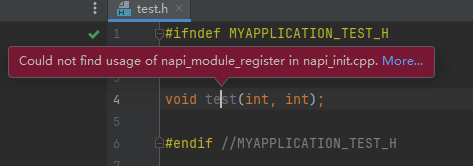
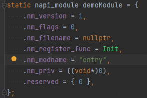
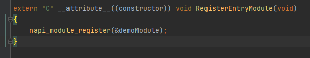

**问题现象**

右键单击函数， 在弹出的菜单中依次选择 Generate... > NAPI， 生成胶水代码报错。

**解决措施**

检查napi\_init.cpp文件的RegisterEntryModule函数中是否调用了napi\_module\_register函数。napi\_module\_register的参数类型为napi\_module\*, napi\_module初始化示例代码如下图所示。然后重新生成NAPI。

字段含义：

nm\_version: N-API模块版本

nm\_flags: 模块的属性标志

nm\_filename: N-API模块的文件名

nm\_register\_func: 注册函数

nm\_modname: 模块名称

nm\_priv: 私有数据指针

reserved: 保留字段

