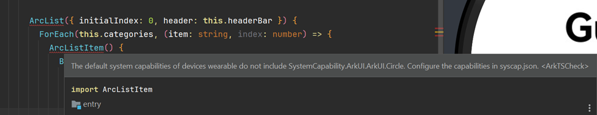
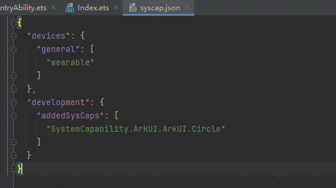

**问题现象**

使用ArcList组件时，编辑器报错，错误信息如下：

**解决措施**

1. 请前往[下载中心](https://developer.huawei.com/consumer/cn/download/)将DevEco Studio更新至6.0.1 Release及以上版本。
2. 若仍需使用当前版本，可在src/main目录下添加syscap.json配置文件。可参考[SysCap开发指导](https://developer.huawei.com/consumer/cn/doc/harmonyos-references/syscap#syscap开发指导)。

