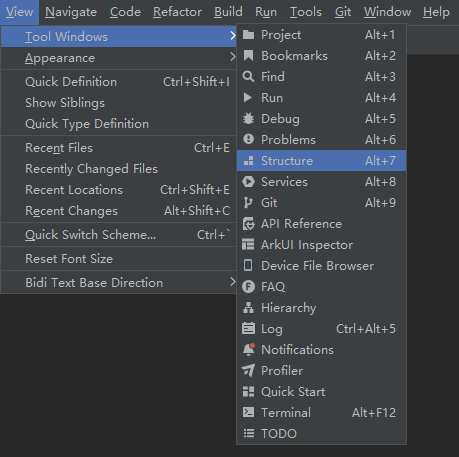

DevEco中有[代码结构树](https://developer.huawei.com/consumer/cn/doc/harmonyos-guides/ide-editer-overview#section388152319329)。使用快捷键Alt + 7 / Ctrl + F12（macOS为Command + 7）打开代码结构树，或者在DevEco Studio中点击菜单：View > Tool Windows > Structure，可以快速查看文件代码的结构树，包括全局变量、函数、类成员变量和方法，并且可以跳转到对应代码行。

