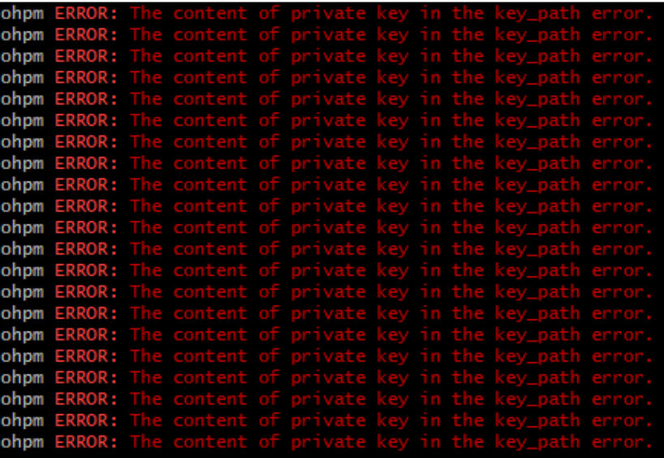

**问题现象**

通过命令行或终端可以正常发布，但在Git Bash上发布时出现错误。

**解决措施**

方法一：从Git官网下载并安装最新版本的Git，使用该版本自带的Git Bash终端进行操作。

方法二：在当前Git安装目录下的etc目录中新增git-bash.config文件，文件中添加一行MSYS=enable\_pcon配置。重新打开Git Bash终端，运行ohpm publish命令即可。
