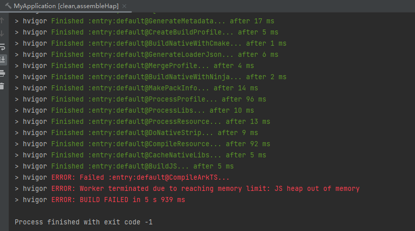
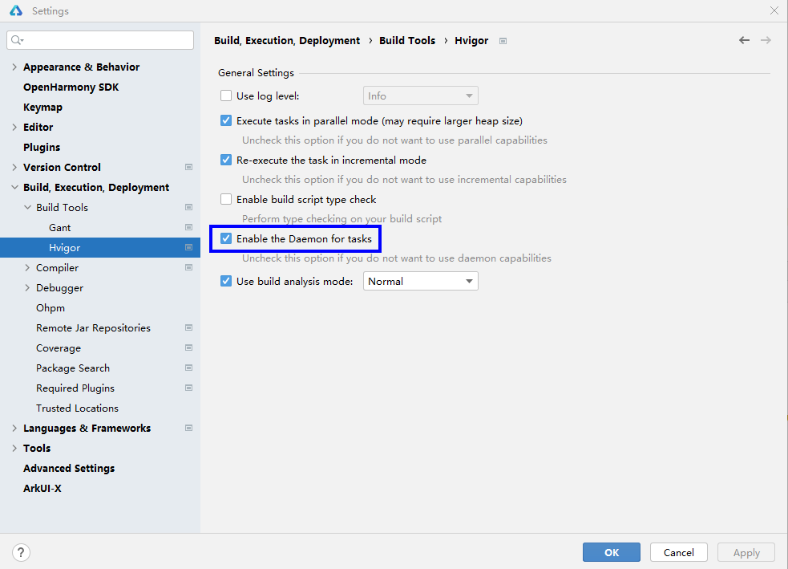

**问题现象**

编译构建时，出现报错“JS heap out of memory”。

**解决措施**

出现该报错的原因是hvigor运行时内存不足。在使用3.1.0及以上版本的hvigor时，可通过以下方式修改hvigor运行时内存的最大值。

勾选 Enable the Daemon for tasks：

在hvigor-config.json5中修改maxOldSpaceSize字段，根据工程大小适当增大，例如设置为 8192。
