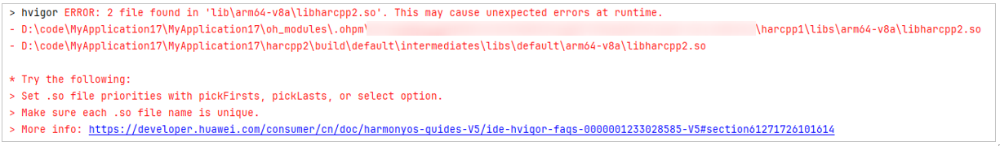

**问题现象**

编译构建时，报错“Duplicated files found in module entry. This may cause unexpected errors at runtime”。



**解决措施**

该报错是从不同的包中收集到了相同名称的so包，导致so包冲突，可在模块级build-profile.json5文件中添加enableOverride字段并设置true。更多内容可参考[模块级build-profile.json5文件](/docs/tools/coding-debug/ide-hvigor-build-profile)。

```
"buildOption": {
  "nativeLib": {
    "filter": {
      "enableOverride": true
    }
  }
},
```
