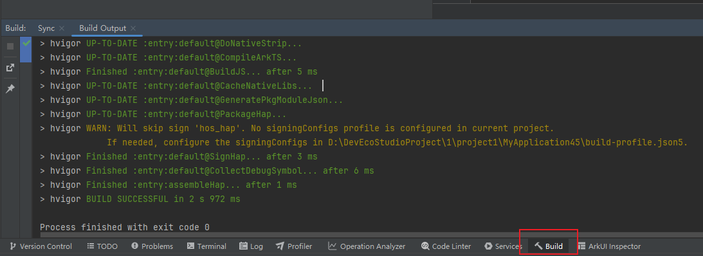
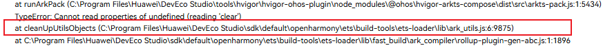
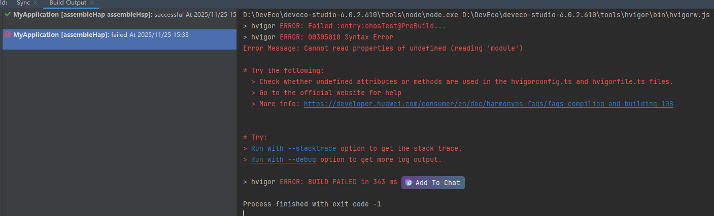
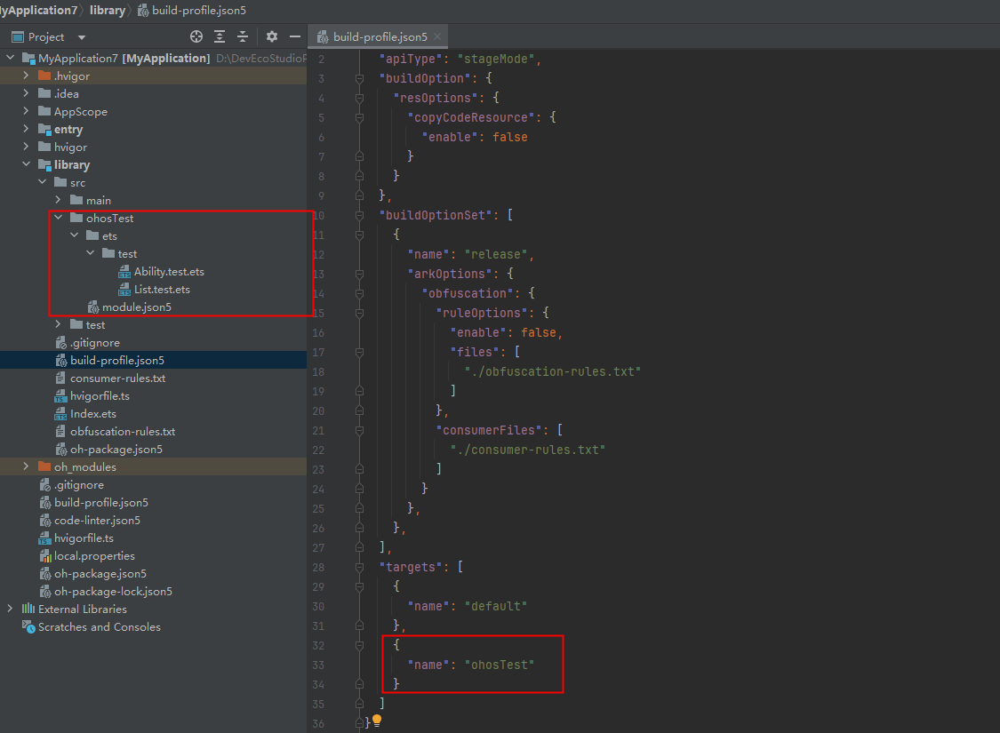
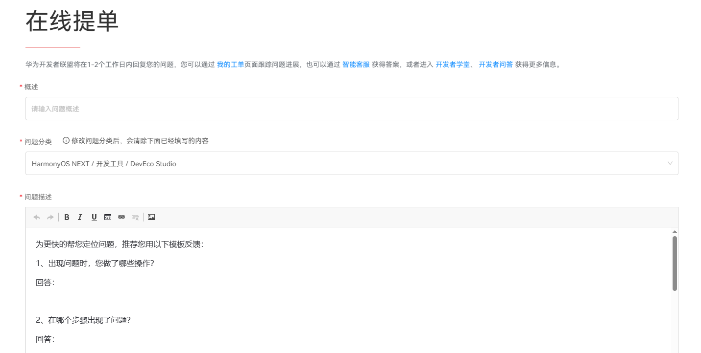

请先根据XXX的值从以下场景排查，没解决问题再参考最终方案。

* **场景一：**

  **问题现象**

  编译构建时，出现报错“Cannot read properties of undefined(reading 'setEnabled')”。

  **问题确认**

  hvigorfile.ts里有如下代码：

  ```
  import { hvigor, getHvigorNode } from "@ohos/hvigor"
  import { hapTasks} from '@ohos/hvigor-ohos-plugin';
  // Problem Code
  getHvigorNode(__filename).getTaskByName('XXX').setEnabled(false)；
  export default {
      system: hapTasks, /* Built-in plugin of Hvigor. It cannot be modified. */
      plugins: []         /* Custom plugin to extend the functionality of Hvigor. */
  }
  ```

  **解决措施**

  1. 确保XXX是当前的HvigorNode里存在的任务。

     假设是entry模块的hvigorfile.ts中的代码导致的问题 ，XXX的有效值就是下图中的“default@SignHap”、“default@CollectDebugSymbol”、“assembleHap”等值。

     
  2. 确保getTaskByName的使用位置是在Hvigor的配置阶段及之后的生命周期里，包括beforeNodeEvaluate、afterNodeEvaluate、nodesEvaluated、taskGraphResolved、buildFinished。

  **参考链接**

  [生命周期及hook点](/docs/tools/coding-debug/ide-hvigor-life-cycle#section746253616316)
* **场景二：**

  **问题现象**

  编译构建时，出现报错“Cannot read properties of undefined(reading 'isSO')”。

  **解决措施**

  升级到DevEco Studio 5.1.0.840及以上的版本。
* **场景三：**

  **问题现象**

  编译构建时，出现报错“Cannot read properties of undefined(reading 'getPluginId')”**。**

  **解决措施**

  确保hvigorfile.ts里export default的对象中的字段system的值是appTasks/hapTasks/hspTasks/harTasks之一。

  ```
  import { harTasks } from '@ohos/hvigor-ohos-plugin';

  export default {
      system: harTasks,  /* Built-in plugin of Hvigor. It cannot be modified. */
      plugins:[]         /* Custom plugin to extend the functionality of Hvigor. */
  }
  ```
* **场景四：**

  **问题现象**

  编译构建时，出现报错“Cannot read properties of undefined(reading 'getNeedExecTargetServiceList')”**。**

  **解决措施**

  确保模块下的module.json5的type字段的值和hvigorfile.ts中export default的对象的system字段符合以下对应关系：

  **表1**

  | module.json5的type字段 | hvigorfile.ts中export default的对象的system字段 |
  | --- | --- |
  | entry | hapTasks |
  | feature | hapTasks |
  | shared | hspTasks |
  | har | harTasks |
* **场景五：**

  **问题现象**

  编译构建时，出现报错“Cannot read properties of undefined(reading 'app')”。

  **解决措施**

  确保工程目录下AppScope/app.json5文件存在。
* **场景六：**

  **问题现象**

  Linux环境下，执行单元测试，出现报错“Cannot read properties of undefined(reading 'toString')”。

  **解决措施**

  Linux环境暂不支持单元测试。
* **场景七：**

  **问题现象**

  编译构建时，出现报错“Cannot read properties of undefined(reading 'kind')”。

  **解决措施**

  检查ArkTS代码是否有如下写法：

  ```
  // Incorrect writing: empty array
  class w {
    public a: [][] = []
    test() {
      console.log("1", this.a[0])
    }
  }
  ```

  ```
  // Correct writing
  class w {
    public a: string[][] = []
    test() {
      console.log("1", this.a[0])
    }
  }
  ```
* **场景八：**

  **问题现象**

  编译构建时，出现报错“Cannot read properties of undefined(reading 'getltem')”。

  **解决措施**

  在加载webview的controller中加入.domStorageAccess(true)。
* **场景九：**

  **问题现象**

  编译构建时，出现报错“Cannot read properties of undefined(reading 'clear')”。

  **问题确认**

  在工程根目录hvigor/hvigor-config.json5文件中配置如下内容打开堆栈。

  ```
  {
    "debugging": {
      "stacktrace": true
      /* Disable stacktrace compilation. Value: [ true | false ]. Default: false */
    },
  }
  ```

  确认堆栈内容是否如下。

  

  **解决措施**

  确认DevEco Studio是否有使用安全加固等三方插件。如果有，可以先禁用三方插件，看是否会复现问题，还能复现就参考下面的最终方案。
* **场景十**

  **问题现象**

  执行hap覆盖率测试时，出现报错：“Error Message: Cannot read properties of undefined (reading 'module')”。

  

  **可能原因**

  工程下hap和hsp模块的build-profile.json5中targets包含ohosTest，但是ohosTest目录不存在，导致构建过程获取模块的ohosTest信息失败。

  **解决措施**

  检查工程所有模块，如果build-profile.json5下targets里配置了ohosTest，模块内确保有src/ohosTest目录及目录对应结构；如不需要ohosTest，则在targets内删除ohosTest。

  
* **最终方案：**

  如果以上场景都不符合，打开堆栈后，根据堆栈信息排查代码。

  堆栈打开方法：工程根目录hvigor/hvigor-config.json5文件中配置如下内容。

  ```
  {
    "debugging": {
      "stacktrace": true
      /* Disable stacktrace compilation. Value: [ true | false ]. Default: false */
    },
  }
  ```

  优先排查hvigorconfig.ts文件和hvigorfile.ts文件，其他代码次之。

  如果上述文件中并未排查出问题，请及时向我们提单反馈。

  请按照如下步骤进行操作：[提单链接](https://developer.huawei.com/consumer/cn/support/)，在线提单 -> 问题分类选择"HarmonyOS NEXT / 开发工具 / DevEco Studio"。

  
