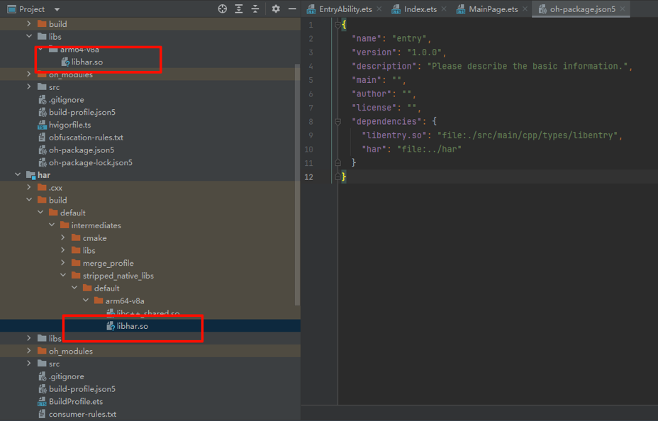
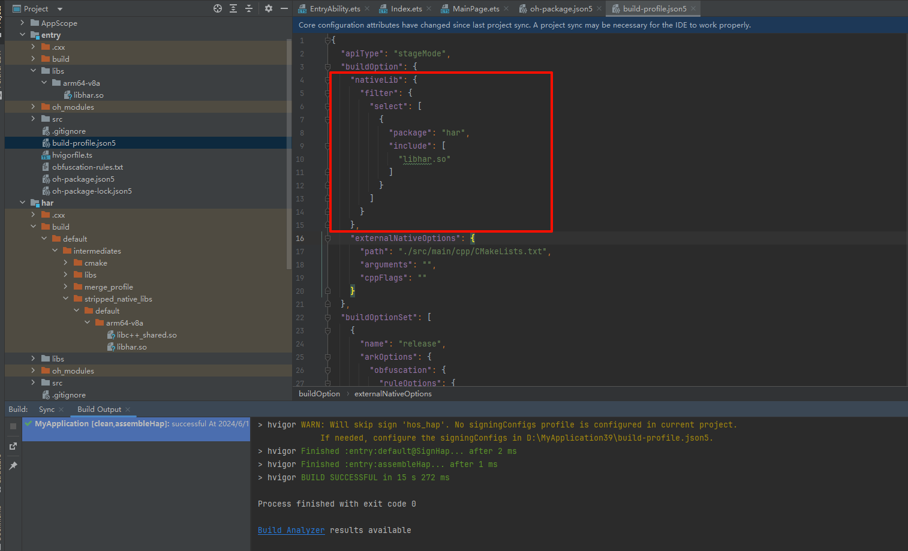

**问题现象**

编译构建时，出现错误信息“Duplicated files found in module xxx. This may cause unexpected errors at runtime”。

构建时存在不同版本的同名SO文件会导致问题。例如，将har模块产物中的SO文件拷贝到entry模块的libs目录下，此时har模块和entry模块中都有一个名为libhar.so的文件。如果再配置entry依赖har，构建entry时就会出现错误。

**解决措施**

使用select、pickFirsts、pickLasts等配置项选择要使用的.so文件。select提供对 native 产物的精准选择，优先级高于excludes、pickFirsts等配置项。pickFirsts和pickLasts按照.so文件的优先级顺序打包，优先级顺序基于依赖收集的顺序，越晚被收集的优先级越高。

具体可参考：[模块级build-profile.json5文件](https://developer.huawei.com/consumer/cn/doc/harmonyos-guides/ide-hvigor-build-profile)。

在entry/build-profile.json5中，配置select选中har模块中的so文件，package选中包名为har的模块，include选中libhar.so文件。

