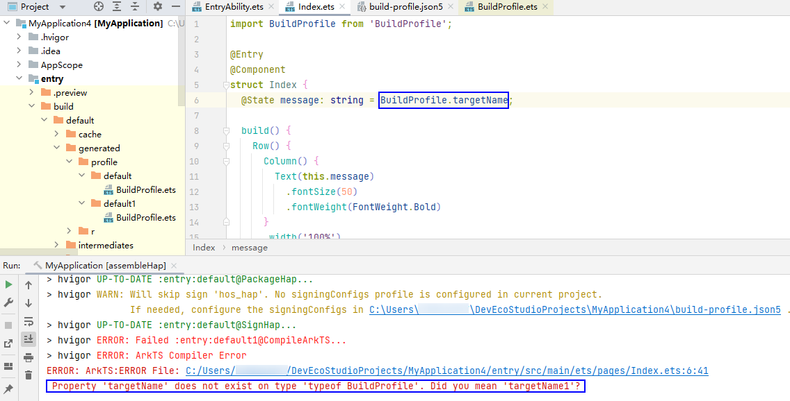
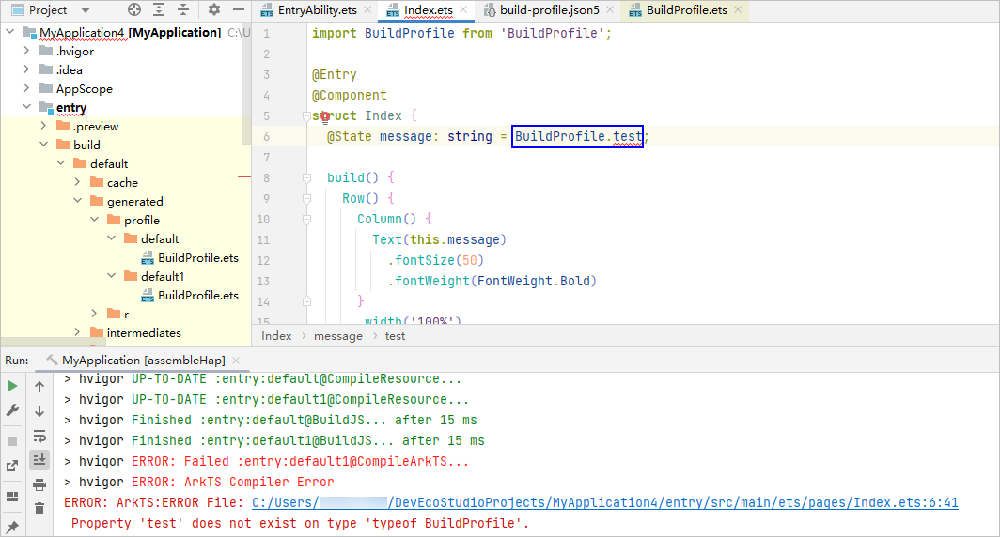

**问题现象****1**

使用自定义参数BuildProfile时，编译过程中未出现异常，但编译构建失败，提示“Property xxx does not exist on type 'typeof BuildProfile'”。



**解决措施**

检查当前模块下build-profile.json5文件中targets>buildProfileFields配置的自定义参数的key值是否一致。如果不一致，请将targets内所有buildProfileFields的key值统一。

以下为导致编译报错的配置示例：

```
"targets": [
  {
    "name": "default",
    "config": {
      "buildOption": {
        "arkOptions": {
          "buildProfileFields": {
            "targetName": "default"
          }
        }
      }
    }
  },
  {
    "name": "default1",
    "config": {
      "buildOption": {
        "arkOptions": {
          "buildProfileFields": {
            "targetName1": "default1"
          }
        }
      }
    }
  }
]
```

将targets内所有buildProfileFields的key值修改为一致，例如都修改为targetName。

**问题现象2**

使用了自定义参数BuildProfile并且编译器标红且构建失败，提示“Property xxx does not exist on type 'typeof BuildProfile'.”。



**解决措施**

检查当前模块下的 build-profile.json5文件，确保buildProfileFields中已添加所使用的自定义参数。
