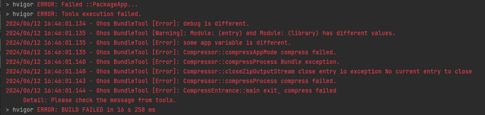
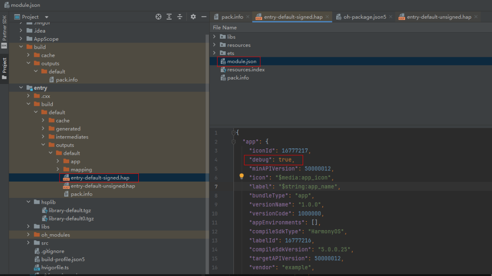
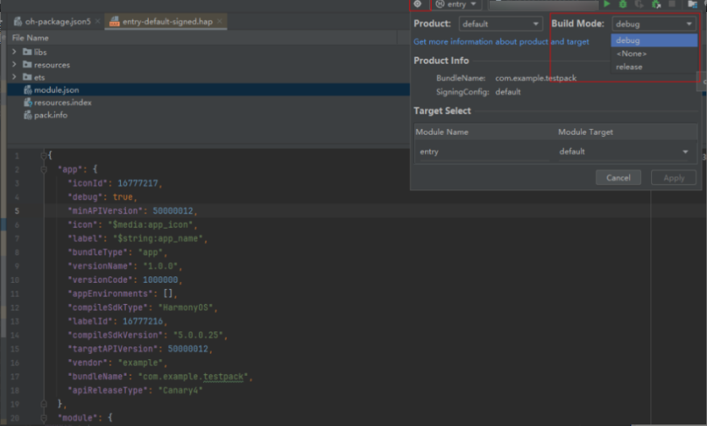

**问题现象**

打包应用时，提示“debug is different”。

**解决措施**

根据报错日志的Warning信息提示的模块名称，检查模块间的debug字段是否一致，重点关注本地模块与外部引用模块。

1.该debug字段由编译构建工具自动生成，保存在HAP/HSP包的module.json文件中，如下图所示，首先确认各模块间该字段是否一致。

2.编译工具根据设置的Build Mode选项生成debug标识，如图所示，可以通过此处进行设置。

