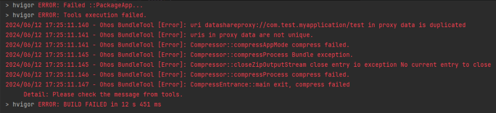
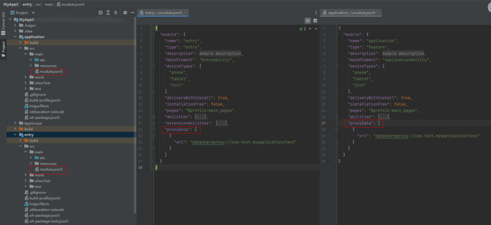

**问题现象**

打包APP时，出现“uri datashareproxy://bundleName/\*\* in proxy data is duplicated”的提示。

**解决措施**

proxyData 标识模块提供的数据代理列表，仅允许 entry 和 feature 配置，不同 proxyData 中配置的 URI 不得重复。遇到此问题，检查模块间是否配置了相同的 URI。

