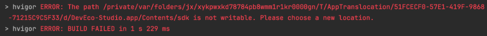

**问题现象**

在Mac上，通过打开DMG文件中的DevEco Studio图标启动DevEco Studio时，如果构建报错“The path XX is not writable. please choose a new location”，请选择一个新的位置。

**问题原因**

在Mac上直接通过DMG中的DevEco Studio图标打开DevEco Studio，会以只读方式打开。内置在DevEco Studio中的文件没有写权限。

**解决措施**

将“DevEco-Studio.app”拖拽到“Applications”文件夹中，安装后再使用。
