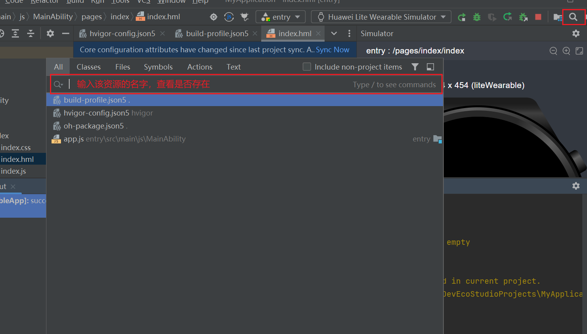

**问题现象**

编译报错。

```
ERROR: Failed :entry:default@CompileResource...
ERROR: Tools execution failed.
Error: ref `$media:icons` don't be defined.
Error: 'icon' value `$media:icons` invalid value.
at D:\project\process_profile\default\module.json
Detail: Please check the message from tools.
```

**报错原因**

引用的资源不存在时，编译错误指向build目录中的文件路径。

**常见场景**

1. 资源文件未添加。
2. 资源文件被意外删除。

**解决方案**

根据报错的资源ID全局搜索，使用右上角的查找按钮，确认报错的资源是否存在。


