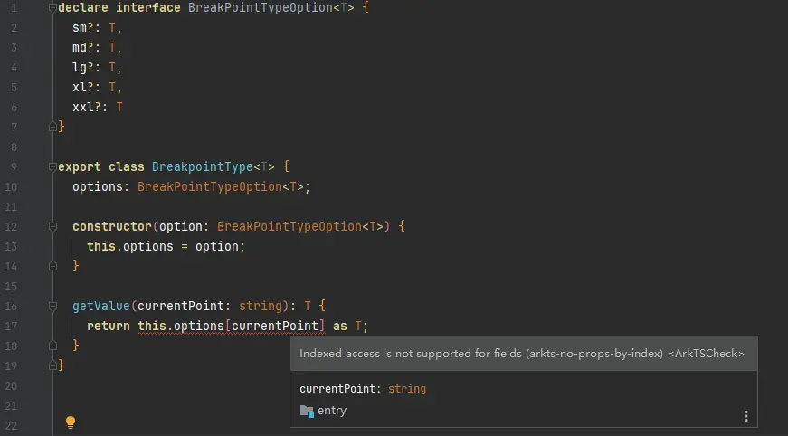

**问题现象**

动态调用类或接口的字段会导致编译报错：Indexed access is not supported for fields (arkts-no-props-by-index)。



**解决方案**

修改代码：

```
getValue(breakpoint: string): T {
  return Reflect.get(this.options, breakpoint) as T;
}
```
