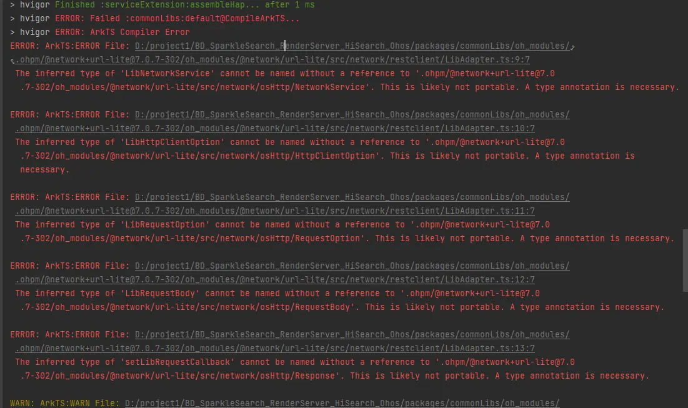

**问题现象**

编译报错“The inferred type of 'xxx' cannot be named without a reference to 'xxx'. This is likely not portable. A type annotation is necessary”。

**问题原因**

HSP生成的.d.ts声明文件缺少类型注解，因为原始文件中未注明类型。

**解决方案**

在报错位置添加类型注解。
