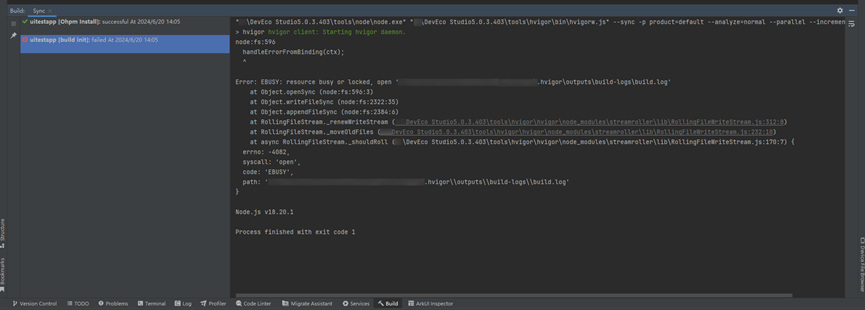
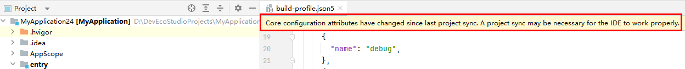
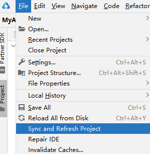
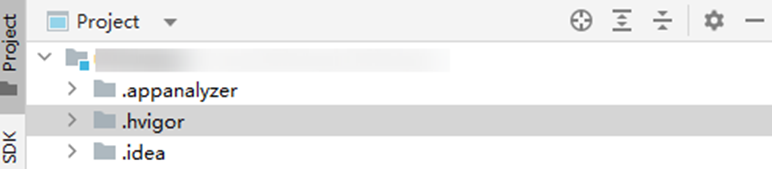

**问题现象**

在升级DevEco Studio至5.0.3.403版本后，打开旧工程时，可能会遇到以下错误：resource busy or locked, open 'xxx\outputs\build-logs\build.log'。

**问题原因**

初始化时，日志写入存在冲突，.hvigor目录中的build-log文件被占用，导致报错。

**解决方案**

* 方法一：点击编辑器窗口上方的Sync Now。

  
* 方法二：点击工具栏**File > Sync and Refresh Project**。

  
* 方法三：如果方法一和方法二无法解决问题，可以手动删除工程目录下的 .hvigor目录，然后重启并执行 Sync。

  
