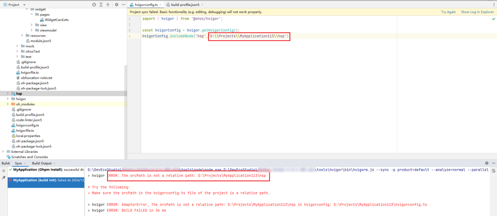

**错误描述**

srcPath字段配置值必须为相对路径。

**可能原因**

开发者在hvigorconfig.ts文件中使用includeNode方法时，srcPath必须是相对路径。

**解决措施**

确保项目的hvigorconfig.ts文件中使用includeNode时的传参srcPath为相对路径。

**参考链接**

[Hvigor脚本文件](/docs/tools/coding-debug/ide-hvigor-life-cycle#section810245135914)
