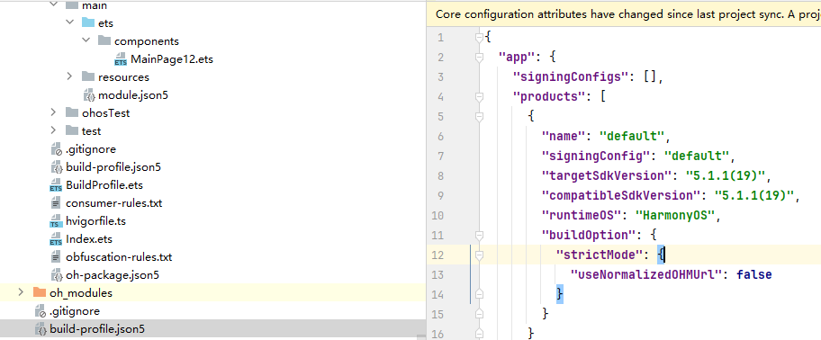

**错误描述**

仅当兼容SDK版本为5.0.0(12)及以上版本时，useNormalizedOHMUrl才可以设置为true。

**可能原因**

当compatibleSdkVersion为5.0.0(12)以下版本时，设置useNormalizedOHMUrl为true导致。

**解决措施**

检查工程级build-profile.json5文件中的compatibleSdkVersion配置。如果compatibleSdkVersion为 4.1.0(11) 及之前版本，请将[useNormalizedOHMUrl](/docs/tools/coding-debug/ide-hvigor-build-profile-app#section13181758123312)设置为false。

