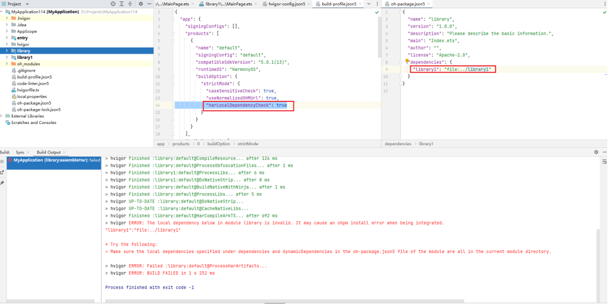

**错误描述**

模块内添加本地依赖项无效。

**可能原因**

当设置"harLocalDependencyCheck": true时，若har模块添加模块外依赖，将触发该编译报错。

**解决措施**

设置"harLocalDependencyCheck": true时，确保模块的oh-package.json5文件中，在dependencies和dynamicDependencies下指定的本地依赖都在当前模块目录下。
