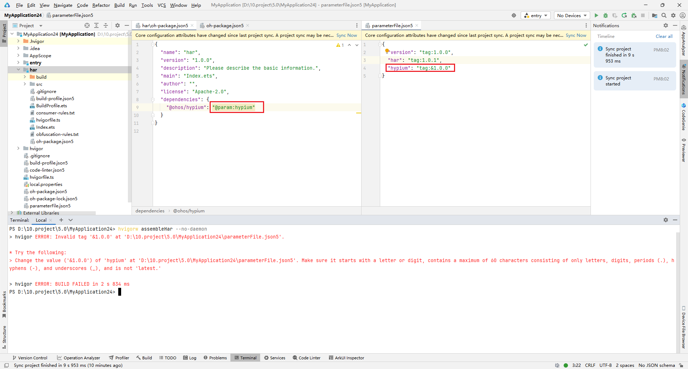

**错误描述**

在xxx/xxx.json5文件中存在无效的tag标签“xxx”。

**可能原因**

在项目根目录的oh-package.json5文件中定义parameterFile参数配置文件的配置版本号时，使用的tag标签包含不符合要求的字符。

**解决措施**

确保parameterFile中定义的tag标签仅由字母、数字、“.”、“-”或“\_”组成，必须以字母或数字开头，长度不超过 60 个字符，且不能配置为latest。
