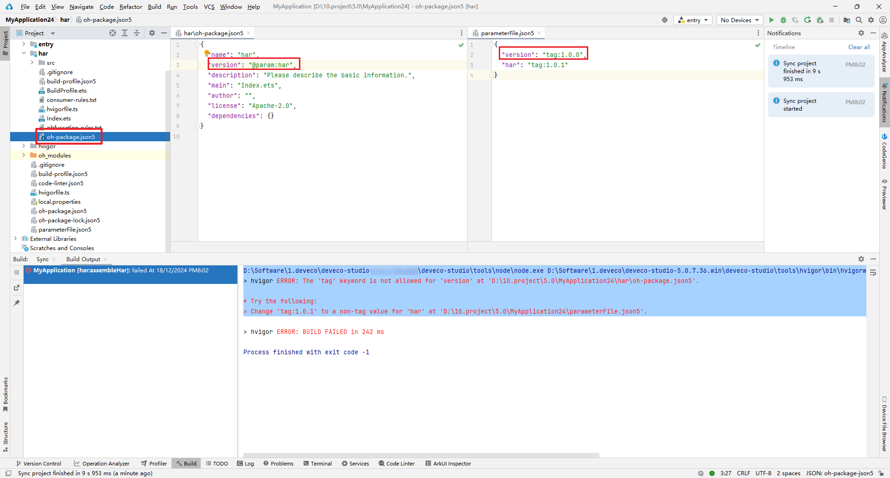

**错误描述**

oh-package.json5文件中的version字段不能包含tag标签。

**可能原因**

使用parameterFile参数化配置版本号时，oh-package.json5文件中的version字段不能包含tag标签。

**解决措施**

当oh-package.json5文件中的version字段引用parameterFile时，开发者不应使用tag标签。
