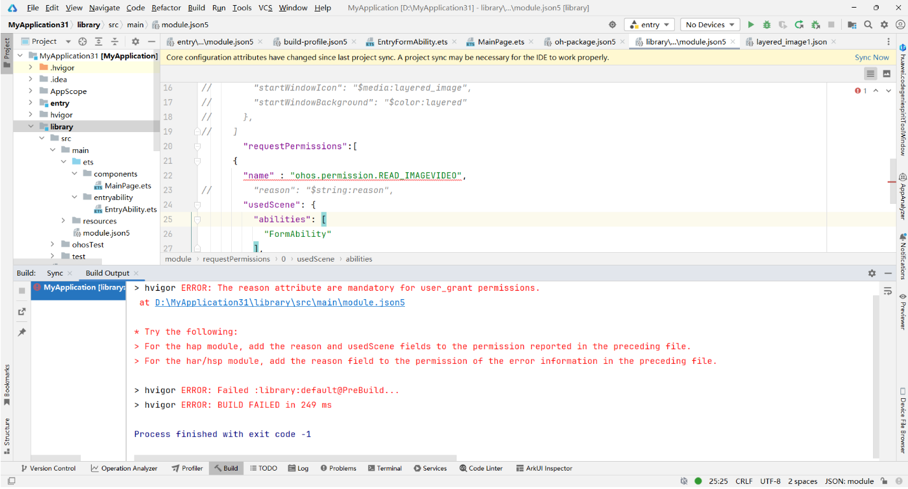

**错误描述**

针对Har和Hsp模块，配置user\_grant权限时必须包含reason属性。

**可能原因**

在module.json5文件中配置user\_grant类型的权限时，必须包含reason属性。



**解决措施**

hap模块的module.json5文件中添加reason和usedScene字段。

在module.json5文件的requestPermissions中添加reason字段，用于har/hsp模块。

示例：

```
"requestPermissions": [
      {
        "name": "ohos.permission.READ_IMAGEVIDEO",
        "usedScene": {
          "abilities": [
            "FormAbility"
          ]
        },
        "reason":"$string:location_permission_reason"
      }
    ]
```
