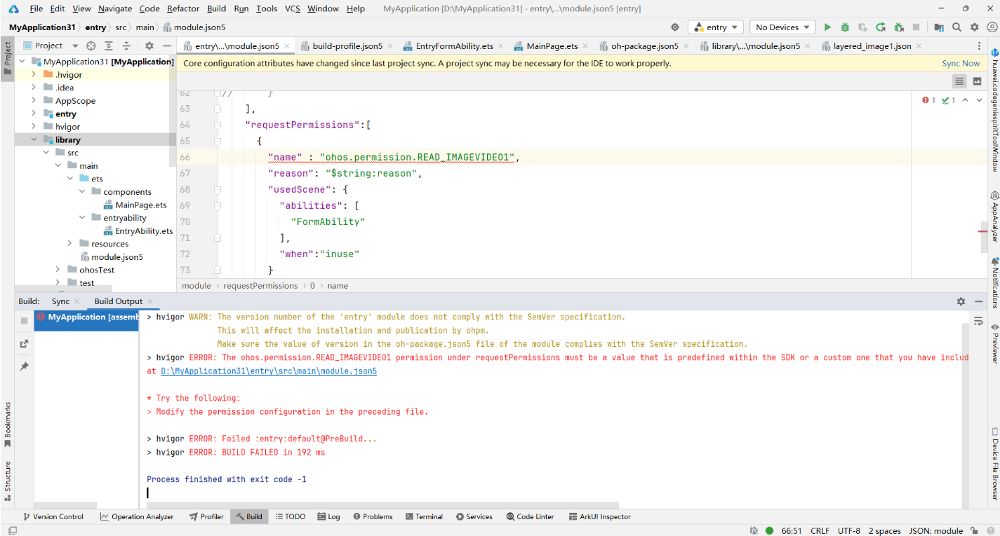

**错误描述**

requestPermissions下的权限必须是SDK中预定义的值，或在definePermissions中定义的自定义值。

**可能原因**

在module.json5文件的requestPermissions中配置name时，使用了不存在的权限名称或者使用了当前版本不支持的权限。

**解决措施**

在module.json5文件的requestPermissions中配置name字段时，必须使用SDK中预定义的权限或在definePermissions下自定义的权限。如果使用了当前版本不支持的权限，建议升级API版本。

例如，若在DevEco Studio 6.0.0 Release版本使用了[ohos.permission.START\_WINDOW\_BELOW\_LOCK\_SCREEN](/docs/dev/app-dev/system/system-security/access-control/app-permission-mgmt/app-permissions/permissions-for-all#ohospermissionstart_window_below_lock_screen)权限，但该权限从API 21开始支持，建议开发者前往[下载中心](https://developer.huawei.com/consumer/cn/download/)将DevEco Studio更新至DevEco Studio 6.0.1 Release及以上版本。
