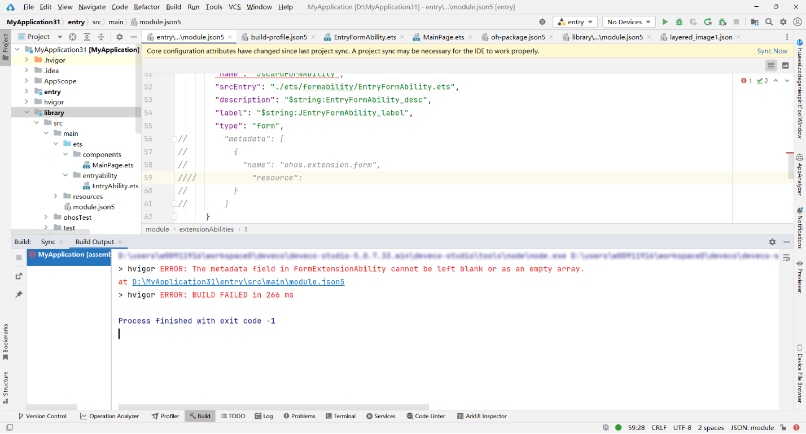

**错误描述**

FormExtensionAbility中的metadata字段必须非空且不为数组。

**可能原因**

在module.json5文件中，当ExtensionAbility的type为form时，metadata字段可以是空对象或空数组。

**解决措施**

在module.json5中type为form的ExtensionAbility中配置metadata字段，具体配置方式参考[配置ArkTS卡片的配置文件](/docs/dev/app-dev/application-framework/form-kit/arkts-ui/arkts-ui-widget-configuration)。
