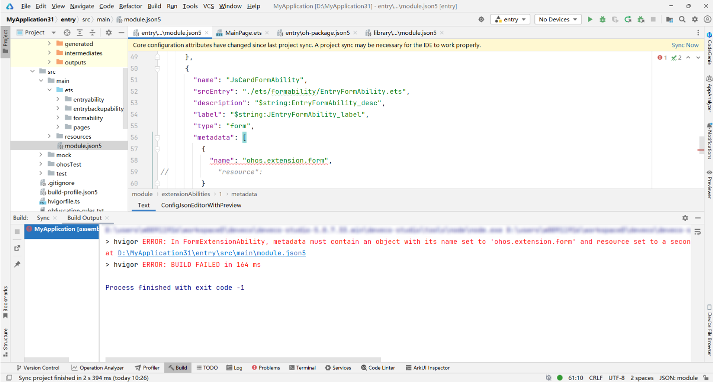

**错误描述**

在FormExtensionAbility中，metadata必须包含一个对象，名称设置为“ohos.extension.form”，资源设置为二级资源引用。

**可能原因**

module.json5中type为form的ExtensionAbility中的metadata缺少name为ohos.extension.form的对象值，或者缺少resource字段。

**解决措施**

在module.json5中type为form的ExtensionAbility中增加metadata字段，补充一个name为“ohos.extension.form”的对象值，并配置对应的resource值，具体配置方式参考[配置ArkTS卡片的配置文件](/docs/dev/app-dev/application-framework/form-kit/arkts-ui/arkts-ui-widget-configuration)。
