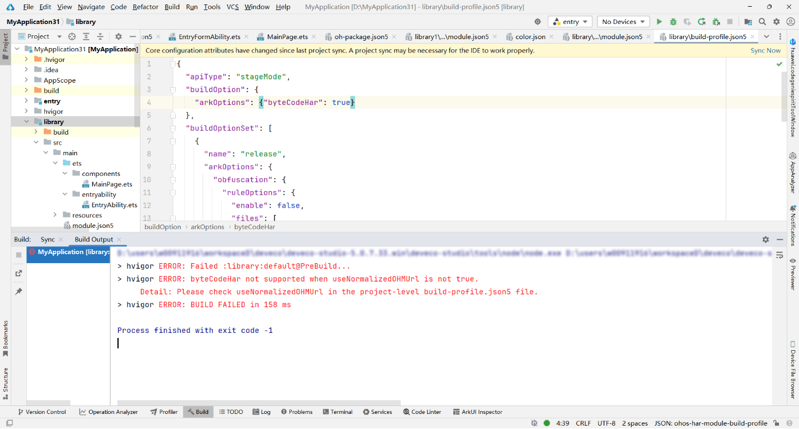
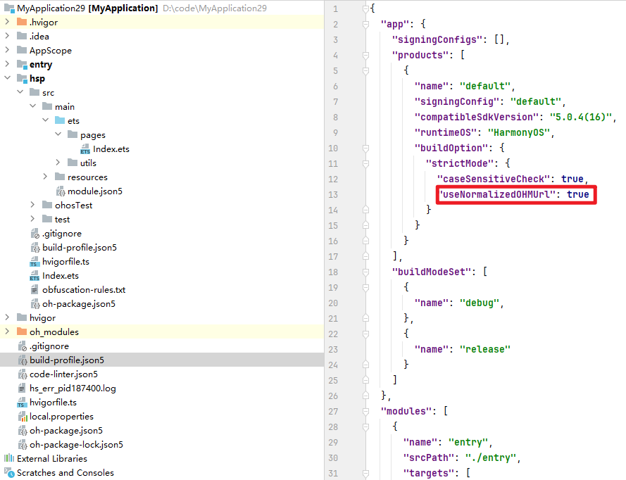

**错误描述**

当useNormalizedOHMUrl配置为false时，不支持编译字节码HAR。

**可能原因**

当HAR模块的build-profile.json5文件中的byteCodeHar字段配置为true时，工程级build-profile.json5文件中的useNormalizedOHMUrl字段未配置为true。

**解决措施**

当HAR模块的build-profile.json5文件中byteCodeHar字段配置为true时，工程级build-profile.json5文件中的useNormalizedOHMUrl字段也必须配置为true。

**参考链接**

[strictMode](https://developer.huawei.com/consumer/cn/doc/harmonyos-guides/ide-hvigor-build-profile-app#section13181758123312)
