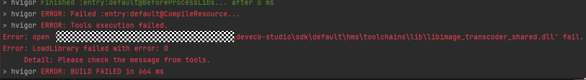
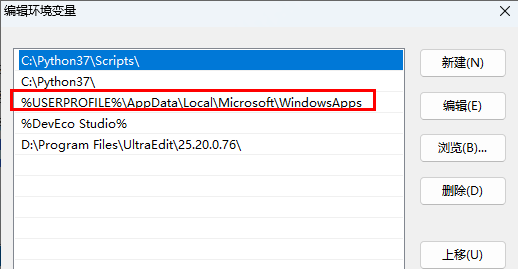
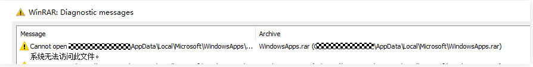

**问题现象**

Windows下编译工程出现错误，提示“Error: open 'xxx\deveco-studio\sdk\default\hms\toolchains\lib\libimage\_transcoder\_shared.dll' failed”，加载dll失败。

**可能原因**

1、系统在环境变量中找不到libimage\_transcoder\_shared.dll及其依赖的第三方库路径。

2、用户环境变量或系统环境变量中的某些路径包含权限受限或损坏的文件，这些文件无法被正常访问。如果这些路径在环境变量中的顺序排在libimage\_transcoder\_shared.dll之前，系统在加载 DLL 时会按顺序搜索环境变量，并首先访问这些出错的文件。

例如，用户环境变量中包含%USERPROFILE%\AppData\Local\Microsoft\WindowsApps。

该路径的文件无法访问。

**解决措施**

1、将报错的路径xxx\deveco-studio\sdk\default\hms\toolchains\lib和xxx\deveco-studio\sdk\default\openharmony\previewer\common\bin手动添加到系统环境变量的最前面。

2、检查用户环境变量和系统环境变量中的所有路径，确保这些路径下的文件均可访问。可以通过尝试修改文件（如覆盖、压缩等）来观察是否有报错。将无法访问的路径从环境变量中删除。
