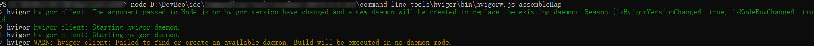
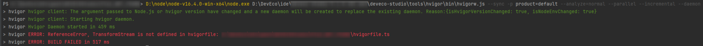
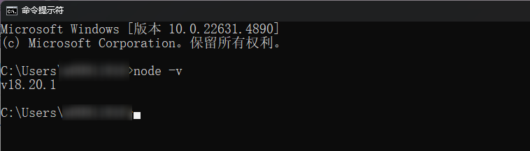
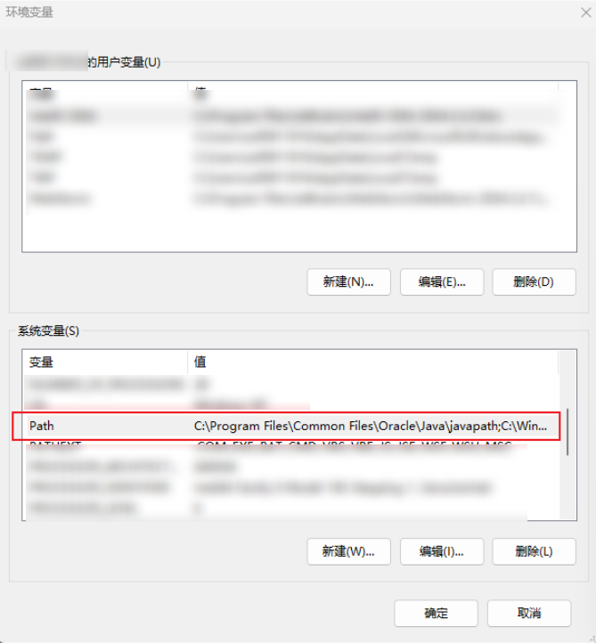
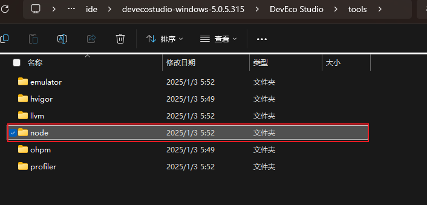
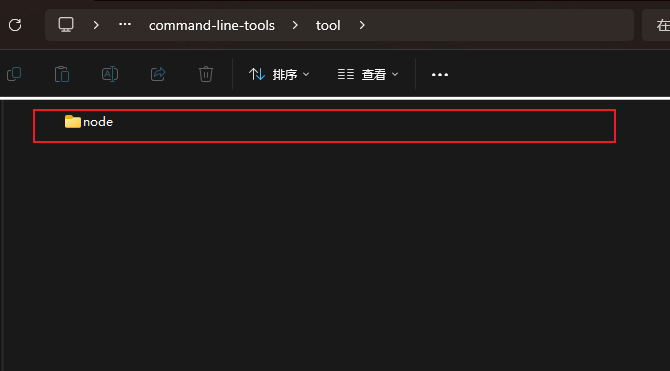
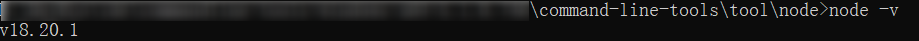

**问题现象**

流水线或命令行中执行命令后在起daemon的日志上：



或者是流水线或命令行中编译报错：



**问题原因**

编译不支持低于v18.0.0的Node.js版本。相关配置查看[配置Node.js环境变量](https://developer.huawei.com/consumer/cn/doc/harmonyos-guides/ide-command-line-building-app#section159168531288)。

**解决措施**

1.确认流水线或计算机配置的Node.js的版本。

Windows通过cmd或Powershell运行， Mac或Linux系统通过终端（Terminal）运行：

```
node -v
```

查看输出：



2.如果流水线或计算机配置的Node.js的版本低于v18.0.0，推荐使用DevEco Studio或Command Line Tools自带的Node.js包来配置系统变量。

Windows系统打开环境变量的配置，将DevEco或Command Line Tool自带的Node.js包的路径添加进系统变量的Path中。如果是通过NODE\_HOME配置的，可以直接修改NODE\_HOME配置的路径。若系统中已存在其他Node.js版本，需将工具自带的Node.js路径添加至Path变量的最前端，确保优先使用该版本；通过NODE\_HOME配置时，需检查Path中是否包含%NODE\_HOME%/bin（Windows）或$NODE\_HOME/bin（Mac/Linux）以确保生效。



Mac或Linux系统参考[配置Node.js环境变量](https://developer.huawei.com/consumer/cn/doc/harmonyos-guides/ide-command-line-building-app#section159168531288)。

DevEco Studio的自带的Node.js的路径为DevEco Studio安装目录/DevEco Studio/tools/node。



Command Line Tools自带的Node.js的路径为Command Line Tools安装路径/command-line-tools/tool/node。



3.将自定义的Node.js版本升级为与DevEco Studio或Command Line Tools自带的Node.js版本一致。通过上述路径运行node -v查看版本，然后在Node.js官方网站中下载对应版本。下载地址为：https://nodejs.org/dist/v18.20.1/。


