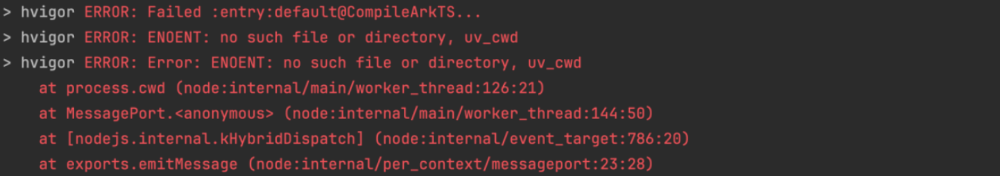

**问题现象**

先构建一次项目，然后强制删除项目后手动恢复再重新构建，出现类似如下报错：



**问题原因**

在Node.js进程运行时，process.cwd()方法返回的是该进程启动时或通过process.chdir()更改后的当前工作目录。若此进程的当前工作目录被强制删除（如用户手动删除项目文件夹），那么后续所有依赖于该路径的操作（如文件读取、目录遍历等）都将失败并抛出错误，因为其引用的目录已不存在。

**解决措施一**

关闭所有Node.js进程再重新进行构建即可。

Linux系统执行:

```
pkill node
```

Mac系统执行:

```
killall node
```

Windows系统执行:

```
taskkill /F /IM node.exe
```

**解决措施二**

流水线打包推荐使用no-daemon模式:

运行hvigorw assemble app/hvigorw assemble hap时修改--daemon 为--no-daemon
