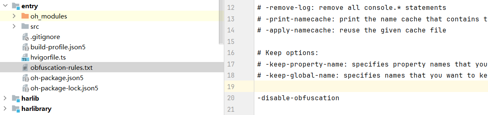

**解决措施**

在主模块下的obfuscation-rules.txt文件中配置-disable-obfuscation选项关闭混淆，确认问题是否由混淆引起。

如果关闭混淆后，功能恢复正常，可以使用DevEco Studio的混淆助手来辅助配置混淆白名单。

**参考链接**

[通过混淆助手配置保留选项](https://developer.huawei.com/consumer/cn/doc/harmonyos-guides/ide-build-obfuscation#section19439175917123)
