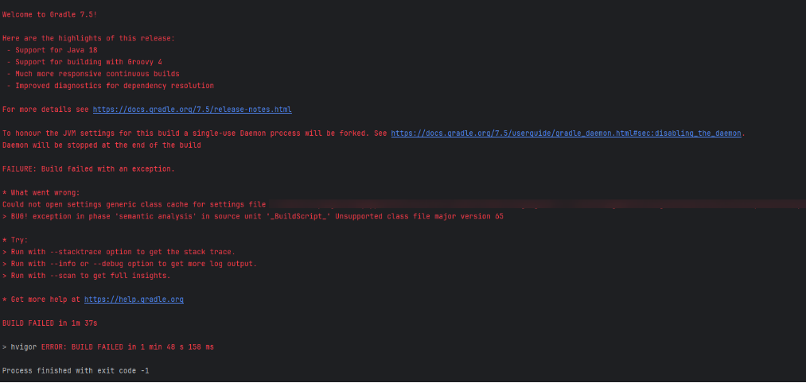
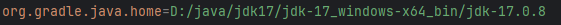

**问题现象**

构建app报错：“Could not open settings generic class cache for settings file”



**常见错误场景**

当前工程使用的是低于DevEco Studio 6.0.0 Beta1 版本的DevEco Studio创建的。

**问题原因**

DevEco Studio 6.0.0 Beta1版本DevEco Studio内置的Java版本为21，当前Gradle的版本低于Java21配套的版本。

**解决措施**：

* **方式一：升级gradle版本**

  修改Gradle-wrapper.properties中的distributionUrl，升级为8.4版本。

  ```
  distributionUrl=https\://repo.huaweicloud.com/gradle/gradle-8.4-bin.zip
  ```

* **方式二：指定使用Java17**

  如果本地有JDK17，可以在Gradle.properties中通过org.gradle.java.home变量指定使用Java17。

  
