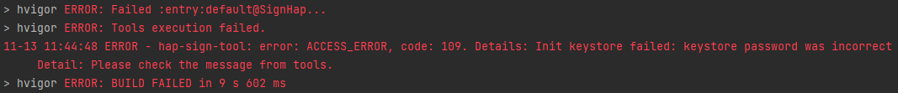
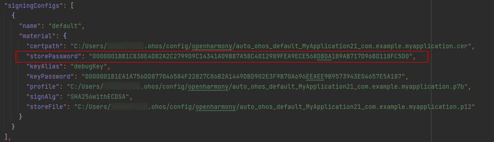

**问题现象**

编译时出现错误，提示“ERROR - hap-sign-tool: error: ACCESS\_ERROR, code: 109. Details: Init keystore failed: keystore password was incorrect”。请检查密钥库密码是否正确。

**报错原因**

密钥库(p12)的密码错误。签名文件中的签名密码错误导致该问题出现。

密钥库密码和密钥密码在创建p12文件时由开发者输入，请牢记这些密码。build-profile.json5文件中记录了密码的密文，但签名工具需要输入密码明文，不能直接使用build-profile.json5中的值。

**常见场景**

1. 密码输入错误。
2. 在命令行中输入了密文。
3. 密钥（keyAlias）密码和密钥库（p12）密码混淆。

**解决措施**

重新自动签名可以解决该问题：

1. 点击**File > Project Structure > Project > Signing Configs**，打开签名配置页面。

2. 勾选“Automatically generate signing”（如果是HarmonyOS工程，还需勾选“Support HarmonyOS”），等待重新签名，点击**OK**。

