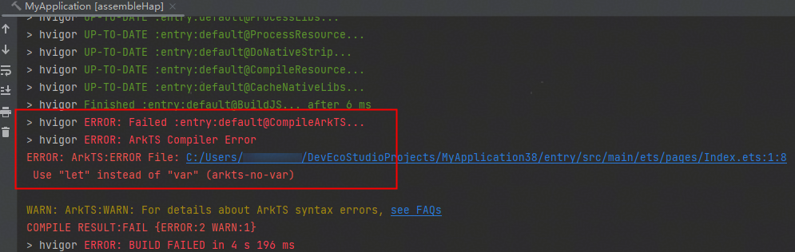
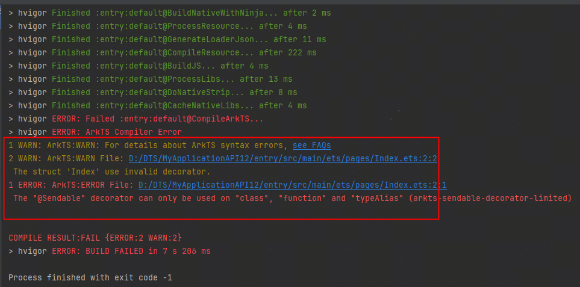

**问题现象**

工程构建时，出现ArkTS语法告警提示，详情请参见FAQ。

报错信息：

1. ERROR: ArkTS:ERROR File: C:/Users/... ,Use "let" instead of "var" (arkts-no-var)
2. ERROR: ArkTS:ERROR File: D:/DTS/MyApplicationAPI12/... ,The "@Sendable" decorator can only be used on "class", "function" and "typeAlias" (arkts-sendable-decorator-limited)

**解决措施**

该告警表明工程中存在不符合ArkTS语法规范的代码，请根据ERROR报错中的报错信息进行修改，或根据提示的语法规则(如arkts-no-var、arkts-sendable-decorator-limited等)，在本网站搜索对应的说明，修改为ArkTS规范写法。ArkTS语言相关介绍请查看[ArkTS（方舟编程语言）](/docs/dev/app-dev/application-framework/arkts)
