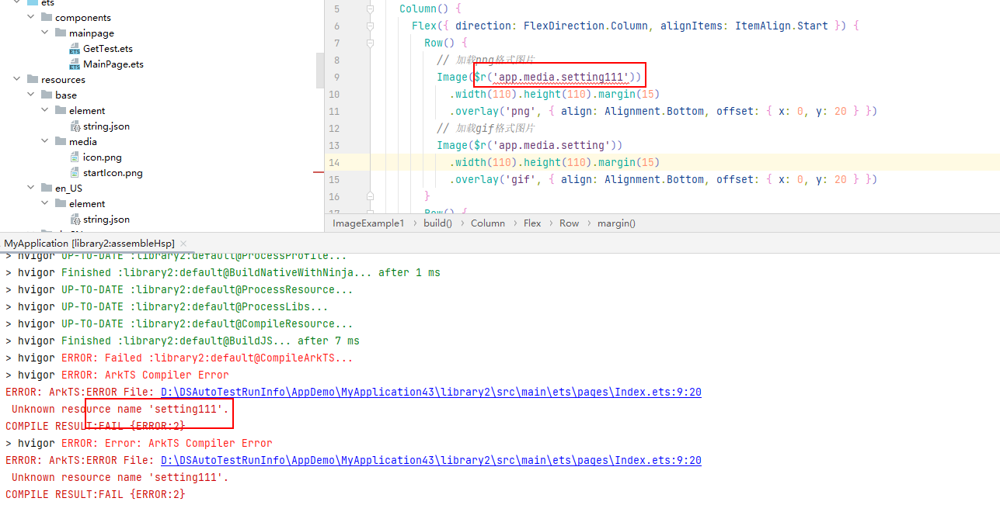
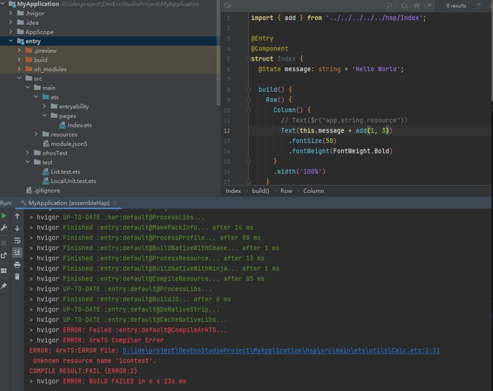
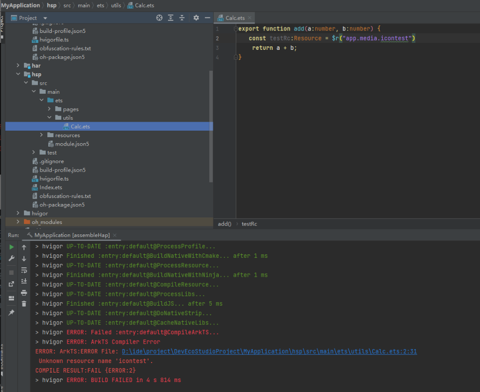
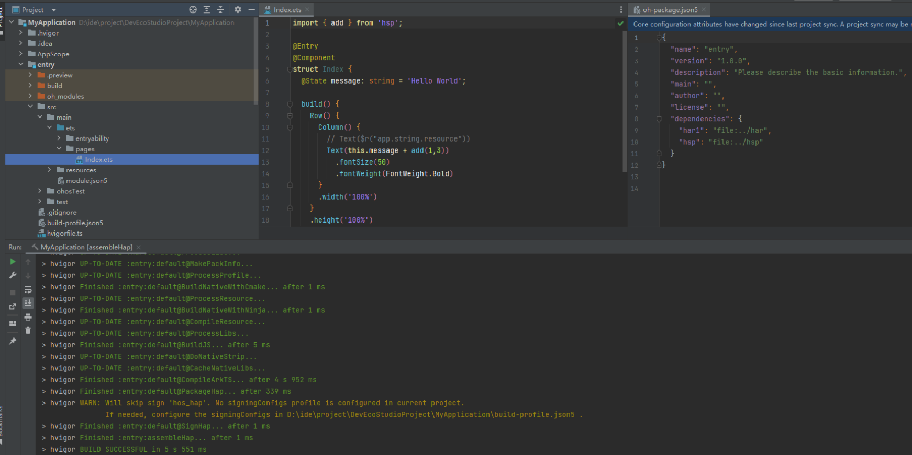

**场景一：**

**问题现象**

工程中模块A引用了模块B，编译模块A时出现错误，提示 "Unknown resource name 'xxxx'"，找不到模块B的资源。

**解决措施**

需要满足以下条件：

1. 资源需放置在模块B目录resource/base路径下，参考链接：[应用资源](/docs/dev/app-dev/multi-device/bpta-multi-device-resource#应用资源)。
2. 模块B已安装。
3. 模块A中不能使用相对路径引用模块B的资源，应直接通过定义的模块名称来引用。

**场景二：**

**问题现象**

引用模块的方式不正确，如果引用的是其他模块的代码，也会导致资源未找到的错误。

**解决措施**

在oh-package.json5中引入该模块。通过定义的模块名称来引用。

如下图所示：

**场景三：**

**问题现象**

HSP A 申请了某个权限并引用了资源。在构建所有依赖 A 的组件时，报错提示找不到 A 引用的资源。

**解决措施**

在引用方的配置文件中手动添加对应资源可以解决此问题。
