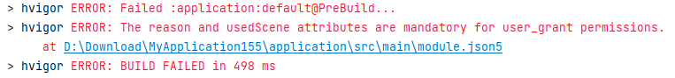

**问题现象**

DevEco Studio编译失败，提示“The reason and usedScene attributes are mandatory for user\_grant permissions”。



**问题原因**

从DevEco Studio NEXT Developer Preview 2版本开始，新增规则：APP包中，所有entry和feature hap的module下的requestPermissions权限清单必须指定（可以为空，若非空则name必填；user\_grant权限则必填reason和usedScene字段）。

**解决措施**

进入对应module.json5文件中，补齐requestPermissions字段下的reason和usedScene字段。如以下示例：

```
"requestPermissions": [
  {
    "name": "ohos.permission.READ_IMAGEVIDEO",
    "reason": "$string:module_desc",
    "usedScene": {
      "abilities": [
        "EntryAbility"
      ],
      "when": "inuse"
    }
  }
],
```
