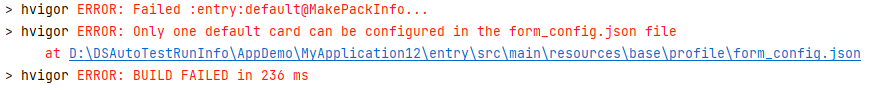

**问题现象**

DevEco Studio编译失败。提示：Only one default card can be configured in the form\_config.json file。

**问题原因**

从DevEco Studio NEXT Developer Preview2版本开始，新增规则：卡片的配置文件中isDefault不可缺省。每个UIAbility有且只有一个默认卡片。

**解决措施**

进入对应module.json5文件，选择唯一默认卡片。将其他卡片的isDefault字段设置为false。
