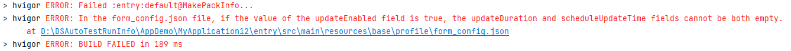

**问题现象**

在form\_config.json文件中，如果updateEnabled字段的值为true，则updateDuration和scheduleUpdateTime字段不能同时为空。

**问题原因**

从 DevEco Studio NEXT Developer Preview 2 版本开始，新增规则：卡片的配置文件中必须包含updateEnabled，设置为true时，可以选择定时刷新（updateDuration）或定点刷新（scheduledUpdateTime）。如果同时配置了两种刷新方式，定时刷新将优先生效。

**解决措施**

进入 module.json5 文件，根据需求选择配置 updateEnabled 为 false，或配置定时刷新（updateDuration）和定点刷新（scheduledUpdateTime）。
