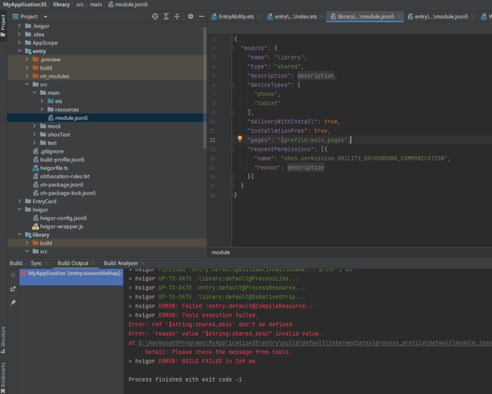
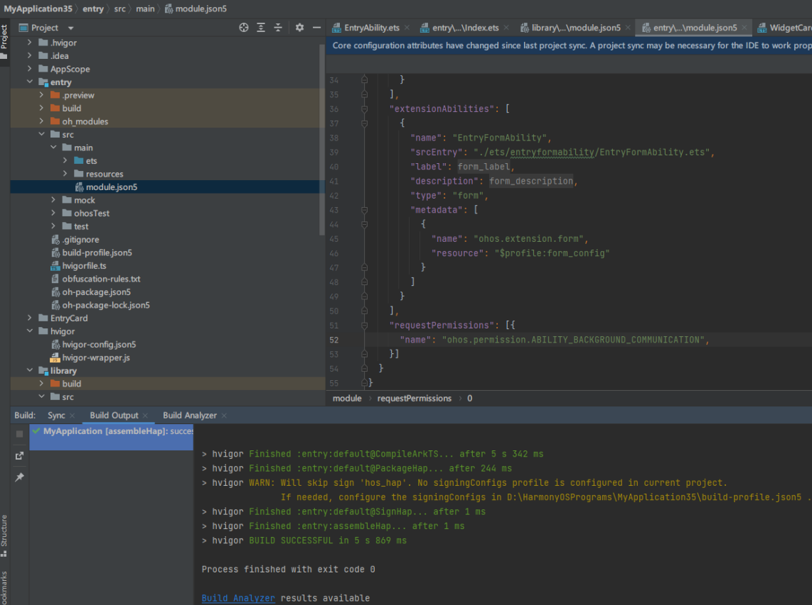

**问题现象**

在构建依赖HSP的HAP模块时，如果出现“ERROR: Failed :entry:default@CompileResource”错误，提示某资源文件不存在，但该资源文件实际存在于HSP内，请检查以下几点：

**问题原因**

出现该问题的原因是HSP的module.json5中声明了权限申请等配置项时，引用了HSP自身的资源文件。构建时会将HSP的资源配置合并到HAP中，但运行时HAP无法直接访问HSP的资源文件。

**解决措施**

* 在各引用的HSP的module.json5中搜索对应资源，确认引入该资源的来源；
* 可以在引用方HAP内或appScope中添加相应资源以规避问题；
* 在引用方HAP的module.json5中声明相同的内容，可以在合并冲突时优先使用引用方HAP中的内容。例如，上图中的报错是由于HSP申请权限引起的，可以通过在引用方HAP中申请相同的权限来避免合并HSP中的这部分内容。

  
