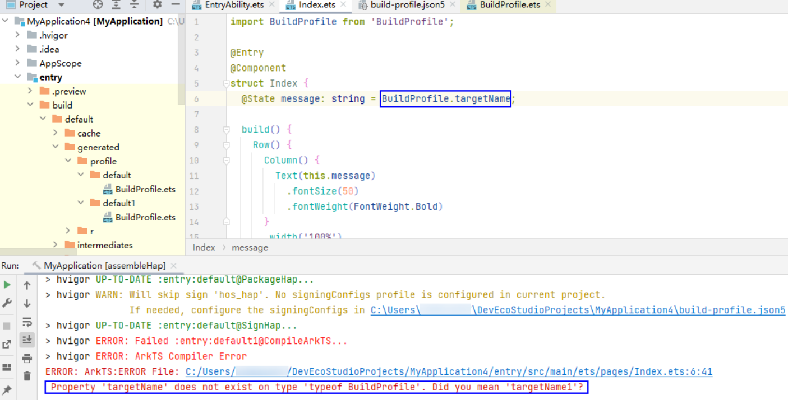
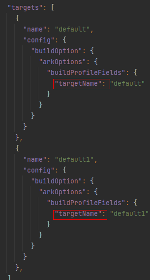

**问题场景一：**

编译时未出现异常，但编译构建失败，提示“Property xxx does not exist on type 'typeof BuildProfile'”，使用了自定义参数BuildProfile。

**解决方案：**

检查当前模块下build-profile.json5文件中的targets > buildProfileFields配置的自定义参数的key值是否一致。如果不一致，请将 targets内所有buildProfileFields的key值统一。

**问题场景二：**

HSP模块对外提供的接口中使用了HAP未定义的自定义参数buildProfileFields，导致编译失败，提示“Property 'XX' does not exist on type 'typeof BuildProfile'”。

**解决方案：**

解决该问题的两种方法：

1. 在HAP中配置与HSP相同的自定义参数BuildProfileFields。

2. 将与HSP相同的自定义参数buildProfileFields配置到工程级 build-profile.json5 中，这会使HSP中的自定义参数在全局生效。

**问题场景三：**

编译时标红，原因是使用了自定义参数BuildProfile，编译器提示“Property xxx does not exist on type 'typeof BuildProfile'”，导致构建失败。

**解决方案：**

请检查当前模块下的build-profile.json5文件中buildProfileFields内是否已添加所使用的自定义参数，确保该参数已配置在buildProfileFields内。
