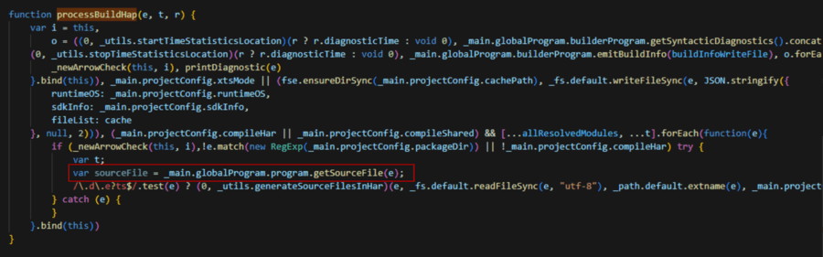
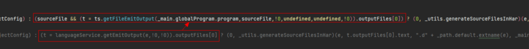

注：此方法为临时规避方案，后续将修复该问题，建议仅在阻塞时使用。

用于减少编译HSP和闭源HAR包时生成声明文件的耗时。

修改 ets\_checker.js 文件（文件路径：SDK路径\default\base\ets\build-tools\ets-loader\lib\ets\_checker.js），编辑 processBuildHap 函数。

1. 生成 sourceFile，在遍历文件时生成声明文件。

   
2. 修改 getEmitOutput 函数，将其改为 getFileEmitOutput 函数，以获取声明文件。

   
