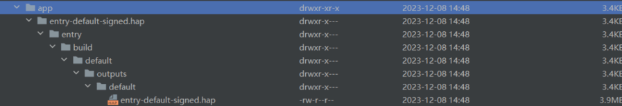

**问题现象**

使用hdc file send向手机发送hap包和hsp包，文件被转换为3.4KB的文件夹。执行install命令时提示解析错误。点击DevEco Studio右上角的绿色小三角按钮，当应用构建成功后，在项目根目录下执行hdc file send "./entry/build/default/outputs/default/entry-default-signed.hap" "data/local/tmp/app/entry-default-signed.hap"命令，最终推送到手机上的仍然不是单个hap包。目录结构如图：

**解决措施**

路径只能使用\\绝对路径，不能使用/相对路径。

绝对路径在DevEco Studio中复制。复制方法：

选中需要发送的文件，右键选择Copy Path/Reference... ->Absolute Path 或者选中文件后按快捷键Ctrl+Shift+C
