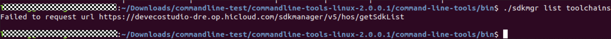
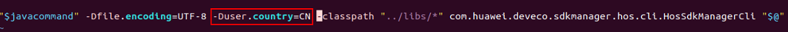

**问**

使用 commandline-tools 工具在 Linux 上时，如果提示“Failed to request URL https://devecostudio-dre.op.hicloud.com/sdkmanager/v5/hos/getSdkList”，请检查网络连接是否正常，确保可以访问该 URL。如果网络无问题，尝试更新 commandline-tools到最新版本。

**解决措施**

该问题通常是因为Linux的国家码未设置为中国区所致。

请参考以下方法解决：

1. 进入sdkmgr脚本所在的文件夹：$\{命令行工具根目录\}/sdkmanager/bin。

   
2. 打开sdkmgr文件。

   
3. 在文件的最后一行，-Dfile.encoding=UTF-8 后面添加 -Duser.country=CN。

   
4. 保存修改，再次执行sdkmgr相关命令即可。
